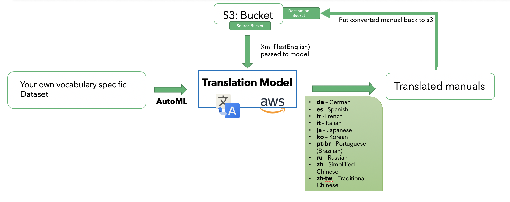
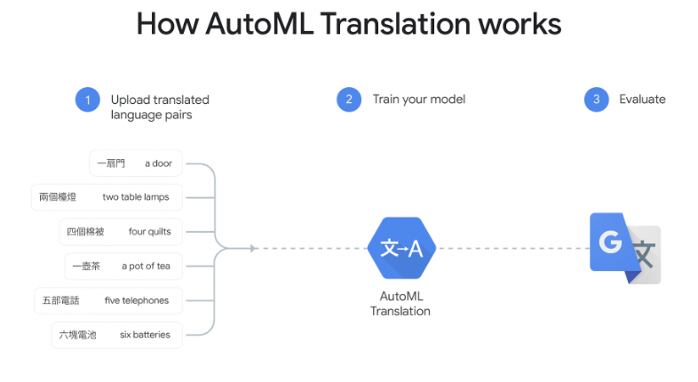

# Machine Language Translation

This project serve as a sample application to translate xml text to any other foreign language using Google and Amazon translate service. If you have your own custom model built using google AutoML, the you can use that functionality as well with this code.


#### Architecture:

This repository serves as an example application to convert the lab manuals from english to 10 foreign languages. Below is the high level architecture diagram:



The xml file are taken from s3 bucket and the converted files are put back into the same s3 bucket, and the bucket parameters are configurable(we will see this later in this Post).On the left side of the diagram you can see that if we have vmware specific vocab dataset then we can feed this dataset to the AutoML of google translate service which can train the model on this dataset. The way AutoML works is it simply takes the input sentences in form of .tsv or .tmx files which contains source examples and target examples(or reference examples), the model then trains on that model. For reference please see the below diagram:



On the similar note, you can also build a custom model using your own dataset which contains the terminologies or sentences which are specific to vmware. Please refer to this link: https://console.cloud.google.com/translation/dashboard?project=ml-manual-translation-project to build your own custom model using AutoML.

#### How to Evaluate a model: BLEU score

* Metric for automatically evaluating machine-translated text.
* It is a number between zero and one that measures the similarity of the machine translated text to a set of high quality reference translation
Machine-translated text to a set of high-quality reference translations.
* A value of 0 means that the machine-translated output has no overlap 
with the reference translation (low quality) .
* A value of 1 means there is perfect overlap with the reference translations (high quality)

NOTE: Even human translators do not achieve a perfect score of 1.0.


#### Directory structure for S3

Your s3 bucket shoule have the following directory structure:
```

your_bucket_name/source
your_bucket_name/target

```

The source folder contains the source xml files, and target folder is where we will keep the converted files.
You can also configure the bucket in the code using:

```

defaults = {
	'bucket_name':"hol-gaurav",
	'src_dir':'source',
	'dst_dir':'target'
	}

```

#### Configure Google Cloud Api for your machine

Before you begin, you need enable apis, command line tool and install python library for google translate. Follow this link to complete this step: https://cloud.google.com/translate/automl/docs/before-you-begin


#### Preparing virtual Environment

You should run this application in python virtual environment. 

Create a virtualenv

```
pip install virtualenv
virtualenv venv
source venv/bin/activate

```

once the virtualenv is activated, install all the requirements:

```

 cd translate
 pip install -r requirements.txt

```

#### Runnning the Application:

It is better to run google translate service as it is fast and works best as compared to amazon translate. Amazon has a limit of 5000 chars per api call, which is the biggest road block.


To run the application run the following command:

```

cd translate
python translate.py --service google --model default

```

The command line argument here are optional. If nothing given the default service used will be google with default google nmt model.

you can change the model to custom, which is based on the custom model you build in google cloud. But for that you will need to change some project related parameters in the __init__() method of translate class like these one:

```

self.project_id = 'Your_project_id'
self.location = 'us-central1'
self.model = 'your model'
self.parent = self.client.location_path(self.project_id, self.location)

```

To run your custom model run the command:

```

cd translate
python translate.py --service google --model default

```

once the application starts running, you should see messages on the terminal like this:

```

(venv) ➜  translate git:(master) ✗ python translate.py --service google --model default
Running the translate application using google service and default model
Translating lab manual: source/manual-2044-01-ism_xml_en
##########################################################
Translating content from en  to de
Total elapsed time to translate the xml document is: 0.7628869851430257 minutes
Uploading the converted documents to s3 bucket results
##########################################################

```

#### LICENSE:
MIT
